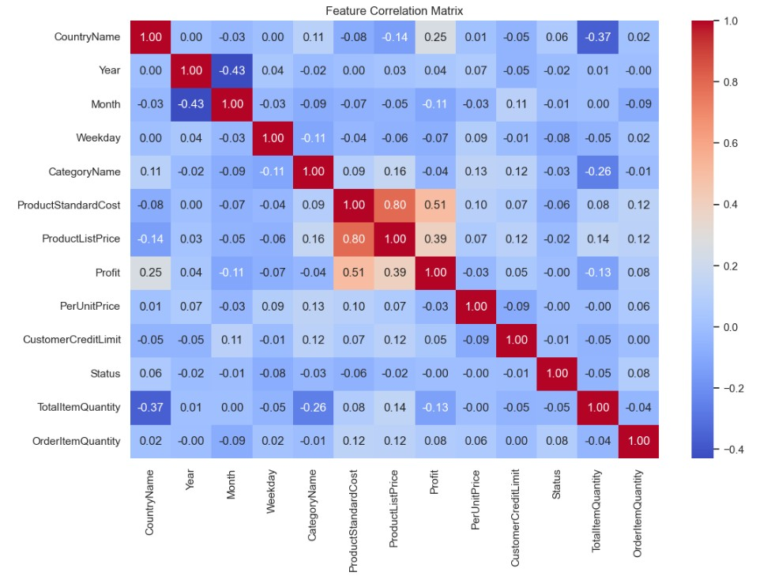

# SupplyChainAI - AI Model for Inventory Optimization

## 📌 Project Overview
SupplyChainAI is an AI-powered predictive analytics model designed to enhance inventory management and optimize supply chain efficiency. The model leverages machine learning techniques to analyze historical sales data, supplier performance, seasonal trends, and production schedules, enabling businesses to:

- Forecast demand accurately.
- Identify supply chain risks.
- Optimize inventory levels and reduce costs.
- Process real-time data for dynamic decision-making.

## 🚀 Core Functionality
### ✅ Demand Forecasting
- Predicts future inventory demand based on historical data.
- Utilizes time series forecasting models such as ARIMA, LSTM, XGBoost, and Prophet.

### ✅ Supply Chain Risk Analysis
- Detects anomalies and disruptions in the supply chain (e.g., supplier delays, stock shortages).
- Uses AI-based anomaly detection techniques like Isolation Forest and Autoencoders.

### ✅ Cost Optimization
- Determines optimal stock levels to reduce excess inventory and minimize holding costs.
- Employs linear programming for cost-effective inventory management.

### ✅ Real-Time Data Processing
- Continuously updates forecasts using new sales and supplier data.
- Can integrate with external databases and APIs for real-time updates.

---

## 📊 Machine Learning Approach
### 📁 Data Sources
- Historical sales and order data
- Supplier lead times and performance metrics
- Market trends and seasonality data
- Warehouse and logistics data

### 🧠 ML Techniques
- **Time Series Forecasting**: ARIMA, LSTM, Prophet, XGBoost
- **Anomaly Detection**: Isolation Forest, Autoencoders
- **Optimization**: Linear Programming for cost minimization

---

## ⚙️ Technology Stack
- **Programming Language**: Python
- **Libraries**: TensorFlow, PyTorch, Scikit-learn, Pandas, NumPy, Matplotlib, Seaborn
- **Development Environment**: Jupyter Notebook
- **Database**: PostgreSQL / MySQL / MongoDB (for structured supply chain data)
- **Cloud Deployment (Optional)**: AWS S3 for storage, SageMaker for training

---

## 🛠 Implementation Steps
### Step 1: Load Dataset
- The dataset `inventory-dataset.csv` is loaded into a Pandas DataFrame for preprocessing.
- Dataset Source: [Kaggle - Inventory Management Dataset](https://www.kaggle.com/datasets/hetulparmar/inventory-management-dataset?utm_source=chatgpt.com)

### Step 2: Data Preprocessing
- Converts `OrderDate` to datetime format.
- Extracts time-based features (Year, Month, Weekday).
- Clips `ProductListPrice` to a reasonable range.
- Selects relevant features for model training.

### Step 3: Exploratory Data Analysis (EDA) & Visualizations
- Visualizes category distribution, order status distribution, and credit limit distribution.
- Analyzes the correlation matrix to understand feature relationships.

**Visualization Examples (Add Screenshots Below)**

- 
- 
- 
- 
- 
- 
- 

### Step 4: Data Encoding & Normalization
- Encodes categorical variables using Label Encoding.
- Scales numerical features using StandardScaler.

### Step 5: Train-Test Split
- Splits the dataset into training and testing sets (80-20 split).

### Step 6: Model Training & Prediction
- **ARIMA**: Trained using SARIMAX for time series forecasting.
- **XGBoost**: A gradient boosting model trained on structured features.
- **LSTM**: A deep learning model trained on sequential sales data.

### Step 7: Model Evaluation
- Evaluates models using:
  - **Mean Absolute Error (MAE)**
  - **Root Mean Squared Error (RMSE)**
  - **R-Squared Score (R²)**
  - **Mean Absolute Percentage Error (MAPE)**

### Step 8: Selecting & Saving the Best Model
- Compares model performances and selects the best one based on RMSE.
- Saves the best model in the following formats:
  - `XGBoost`: `best_model_xgb.pkl`
  - `LSTM`: `best_model_lstm.h5`
  - `ARIMA`: `best_model_arima.pkl`

---

## 📈 Results & Findings
### Model Performance
- **ARIMA**: MAE: 32.68, RMSE: 37.73, R²: -0.04, MAPE: 47.73%
- **XGBoost**: MAE: 35.75, RMSE: 42.21, R²: -0.30, MAPE: 53.69%
- **LSTM**: MAE: 33.07, RMSE: 37.44, R²: -0.02, MAPE: 46.44%

### Best Model Selection
- The **LSTM model** achieved the lowest RMSE (37.44), making it the best-performing model for inventory demand forecasting.

### Insights
- **Demand Patterns**: Identified seasonal trends and key demand drivers.
- **Optimization Insights**: Suggested optimal reorder points and inventory thresholds.

---

## 📖 Usage Instructions
1. **Install dependencies**:
   ```bash
   pip install pandas numpy matplotlib seaborn scikit-learn tensorflow xgboost statsmodels
   ```
2. **Run the Jupyter Notebook**:
   ```bash
   jupyter notebook supplychainai.ipynb
   ```
3. **Load dataset**:
   ```python
   df = pd.read_csv('inventory-dataset.csv')
   ```
4. **Train and Evaluate Models**
5. **Save and Deploy the Best Model**

---

## 🤝 Contributor & Contact
**Developer**: Md. Jisan Ahmed
**Email**: jisan3325@gmail.com

For inquiries, feel free to reach out!

---

## 🌟 Acknowledgments
Special thanks to the open-source community and contributors to Scikit-learn, TensorFlow, and XGBoost for their powerful machine learning tools.

